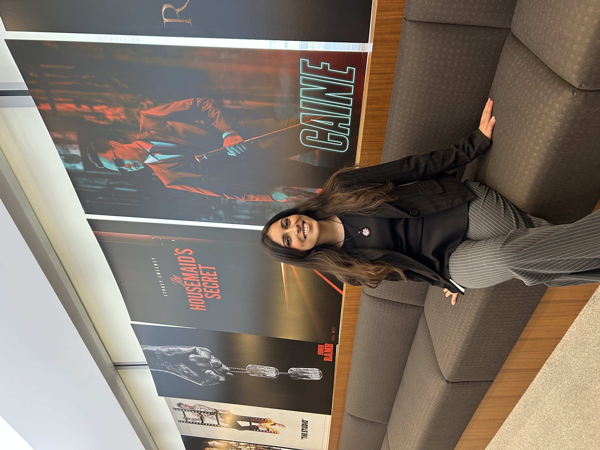
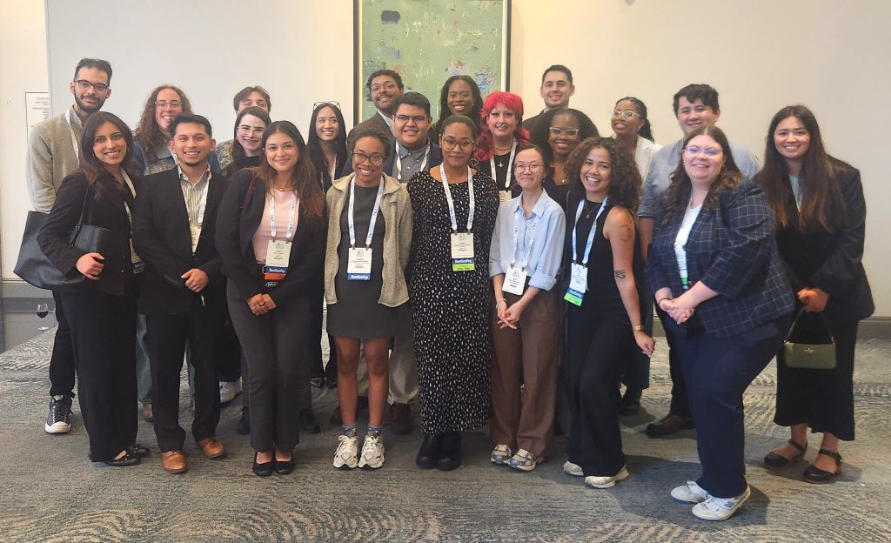
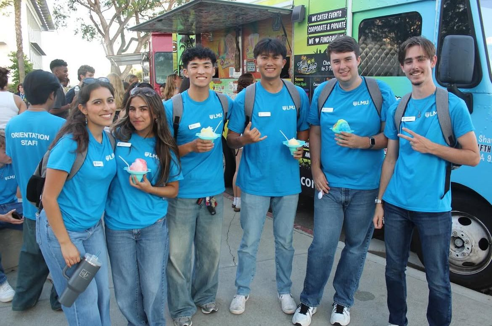

## Professional Background

My experiences have allowed me to explore the intersection of research, data analysis, and strategic decision-making across multiple areas.

## Featured Experiences

::: {.columns}

::: {.column width="65%"}

### Lionsgate

[INCLUSIVE CONTENT & STRATEGY INTERN]{.project-label}

*Santa Monica, CA | June – August 2026*

As an Inclusive Content & Strategy Intern, I explored how audience research, cultural insights, and market trends can inform entertainment strategy.

**Skills:** Consumer Insights · Market Research · Audience Strategy · Entertainment

:::

::: {.column width="35%"}

{.rounded width="100%"}

:::

:::

---

::: {.columns}

::: {.column width="65%"}

### University of California, Irvine  
### Center for Population, Inequality & Policy

[NEXTGENPOP RESEARCH FELLOW]{.project-label}

*Irvine, CA | June 2025 – May 2026*

As a Research Fellow, I conducted quantitative research examining demographic and health patterns among immigrant populations using survey data and RStudio.

**Skills:** Quantitative Research · R / RStudio · Data Analysis · Demographic Research

:::

::: {.column width="35%"}

{.rounded width="100%"}

:::

:::

---

::: {.columns}

::: {.column width="65%"}

### Loyola Marymount University  
### Department of Sociology

[RESEARCH ASSISTANT]{.project-label}

*Los Angeles, CA | January 2024 – December 2025*

Supported faculty research examining the experiences of Latinx immigrant communities through qualitative interview analysis, data organization, and research communication.

**Skills:** Qualitative Research · Interview Analysis · Data Organization · Canva Design

:::

::: {.column width="35%"}

<iframe
  src="assets/2025_SOCL_Newsletter_Final.pdf"
  width="100%"
  height="400px">
</iframe>

:::

:::

---

::: {.columns}

::: {.column width="65%"}

### Loyola Marymount University  
### Admissions

[ORIENTATION LEADER]{.project-label}

*Los Angeles, CA | July 2024 – Present*

Support incoming students as they transition to LMU by facilitating orientation programming, communicating campus resources, and fostering community.

**Skills:** Communication · Collaboration · Student Engagement · Community Building

:::

::: {.column width="35%"}

{.rounded width="100%"}

:::

:::
<section id="resume">
    <h2>Resume</h2>

    

        Explore my professional experience, research background,
        and technical skills in detail.
    

    <iframe
        src="assets/Stephanie_Pacheco_Resume.pdf"
        width="100%"
        height="700px"
        style="border: none;">
    </iframe>

    

        <a href="assets/Stephanie_Pacheco_Resume.pdf" download>
            Download My Resume (PDF)
        </a>
    

</section>

Let's connect!
[LinkedIn](https://www.linkedin.com/in/stephanieapacheco/)