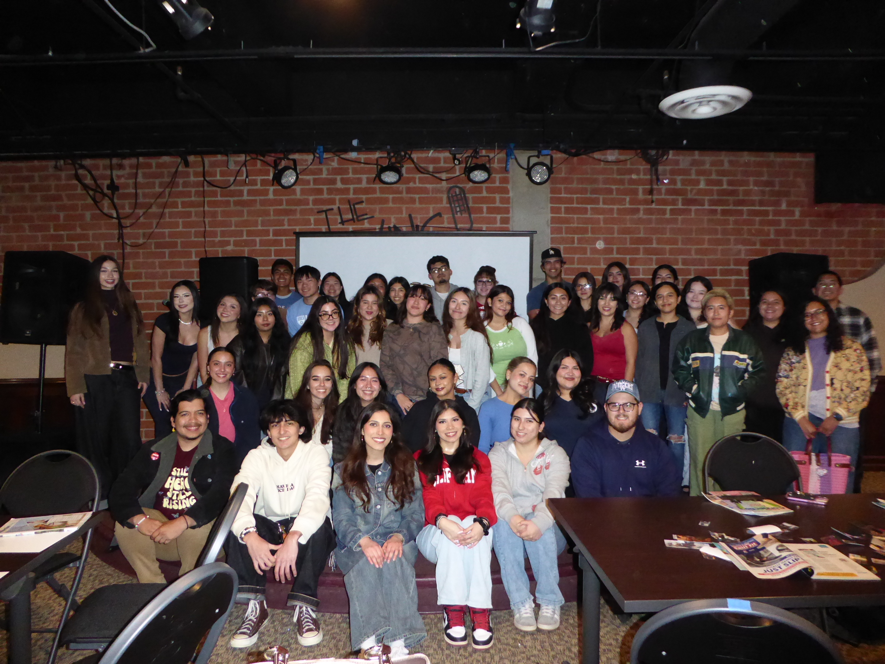
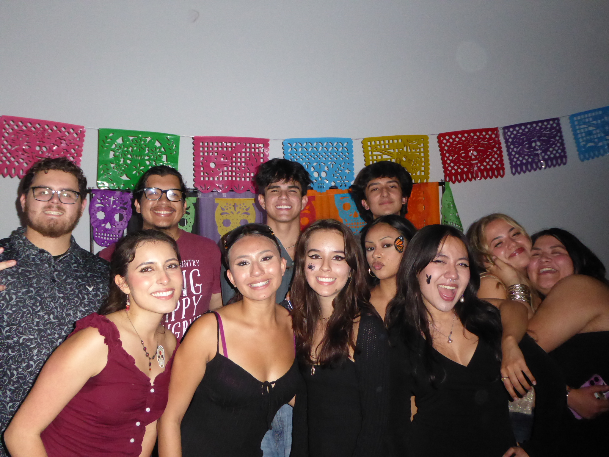
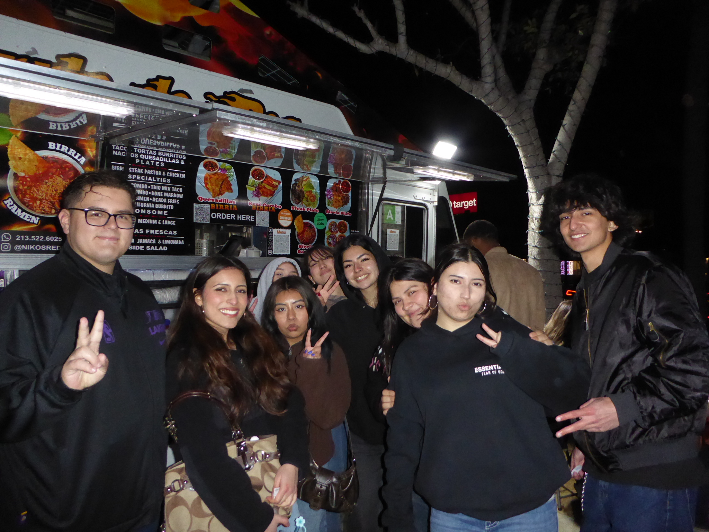
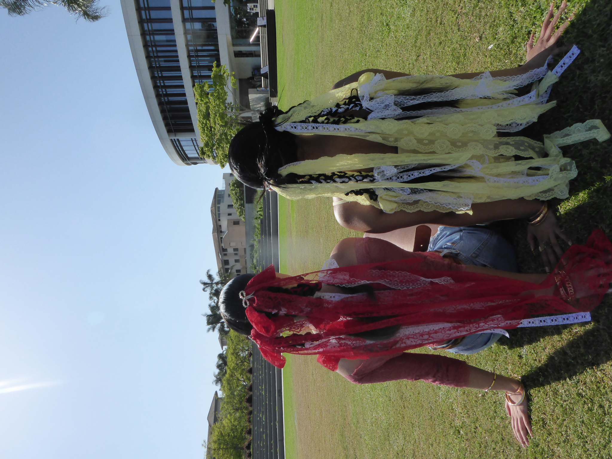
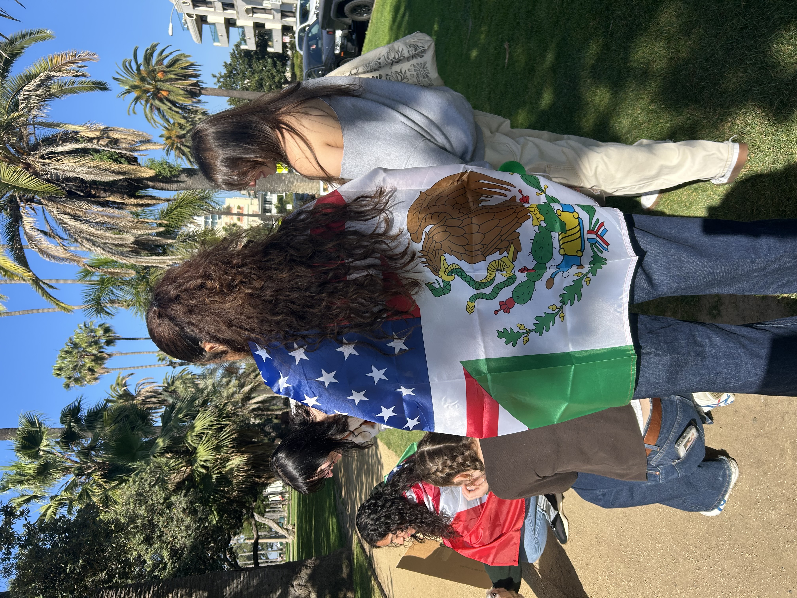

## Latinx Student Union President '25-'26, Vice President '26-'27

::: {.columns}

::: {.column width="65%"}

[PRESIDENT, VICE PRESIDENT]{.project-label}

*Los Angeles, CA | June 2025 – Present*

Leading a cultural organization dedicated to fostering an inclusive Latine community through student engagement, professional development, and campus collaboration.

:::

::: {.column width="35%"}

{.rounded width="100%"}

:::

:::

### By the Numbers

::: {.columns}

::: {.column width="25%"}

## **$1,000+**

Raised over the academic year

:::

::: {.column width="25%"}

## **120+**

Attendees at semi-formal event

:::

::: {.column width="25%"}

## **+40%**

Year-over-year engagement

:::

::: {.column width="25%"}

## **13**

Campus collaborations

:::

:::

::: {.columns}

::: {.column width="47%"}

{.rounded width="100%"}

[SEMI-FORMAL EVENT]{.project-label}

120+ attendees

:::

::: {.column width="6%"}

:::

::: {.column width="47%"}

{.rounded width="100%"}

[EXECUTIVE BOARD]{.project-label}

12 members

:::

:::

::: {.columns}

::: {.column width="47%"}
{.rounded width="100%"}

[CAMPUS COLLABORATION]{.project-label}

13 collaborations

:::

::: {.column width="6%"}

:::

::: {.column width="47%"}
{.rounded width="100%"}

[STUDENT ENGAGEMENT]{.project-label}

+40% year-over-year engagement

:::

:::

*Our Motto: La Cultura Cura - Culture Heals*
