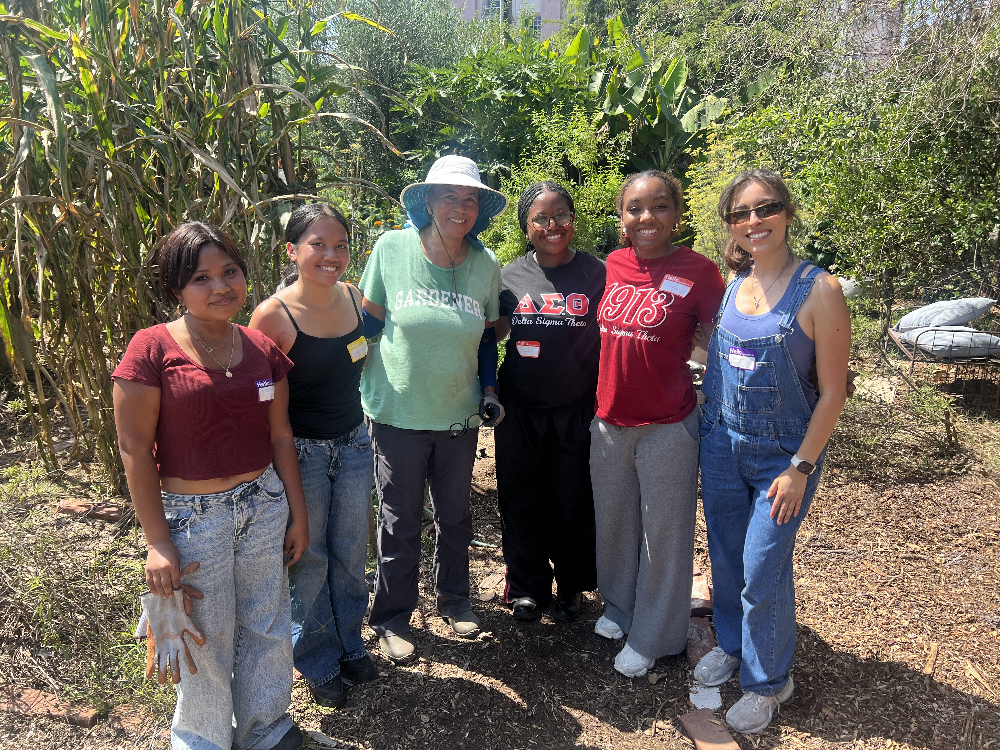
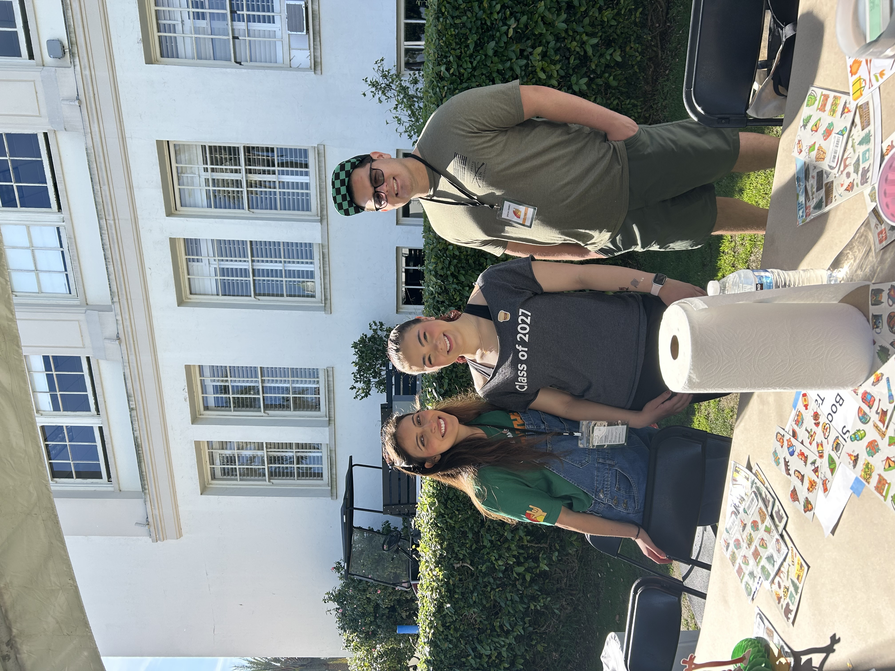
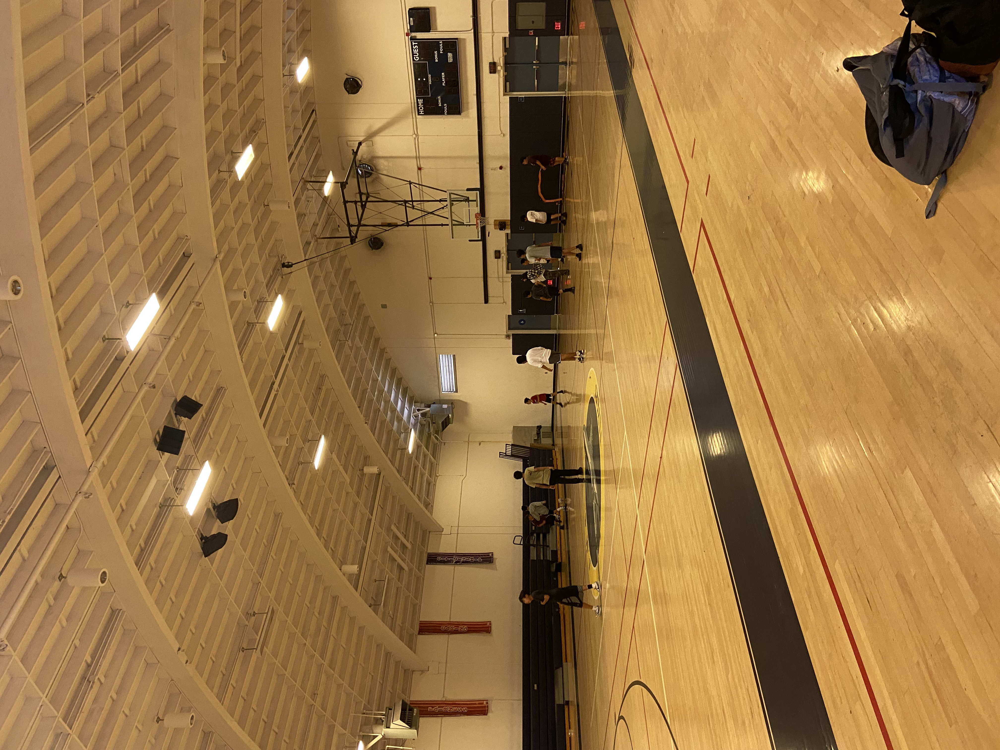

## Community Involvement

I value opportunities to support others, build meaningful connections, and contribute to the communities around me. Through mentorship and campus service, I have developed a deeper appreciation for inclusion, encouragement, and community engagement.

::: {.columns}
::: {.column width="65%"}
## The Learning Garden Volunteer

[COMMUNITY SERVICE]{.project-label}

*Loyola Marymount University | September 2026*

Volunteered at The Learning Garden in Venice through LMU's Center for Service and Action during Serve LA Weekend. Beautified the garden by hand-pulling weeds, placing barrier paper, and mulching.

:::

::: {.column width="35%"}

{.rounded width="100%"}

:::

---

::: {.columns}
::: {.column width="65%"}
## LMU Special Games Volunteer

[COMMUNITY SERVICE]{.project-label}

Loyola Marymount University | March 2024 & March 2025

Volunteered at LMU's Special Games, supporting an inclusive recreational experience for participants with intellectual and physical disabilities. Helped facilitate activities and encouraged participation, connection, and community involvement.

:::

::: {.column width="35%"}

{.rounded width="100%"}

:::
:::

---

::: {.columns}
::: {.column width="65%"}

## El Espejo Mentor

[YOUTH MENTORSHIP]{.project-label}

Lennox Middle School | September – December 2023

Volunteered as a youth mentor, supporting middle school students through mentorship, guidance, and relationship-building. Helped foster a positive environment where students could feel supported, encouraged, and connected.

:::

::: {.column width="35%"}

{.rounded width="100%"}
:::
:::

---

## Outside of Work & the Classroom

I enjoy:

- Thrifting
- Fitness
- Listening to music
- Trying new restaurants in the South Bay/LA
- Spending time with my family and dog

Let's connect!
[LinkedIn](https://www.linkedin.com/in/stephanieapacheco/)